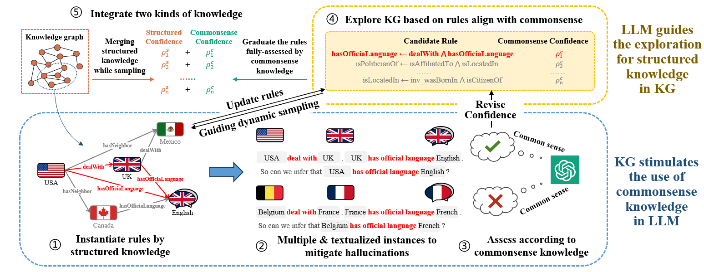
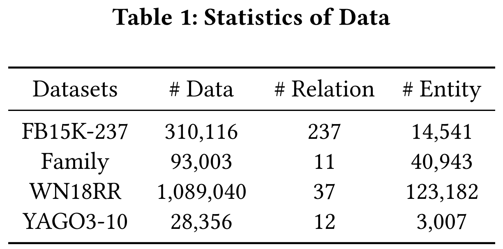
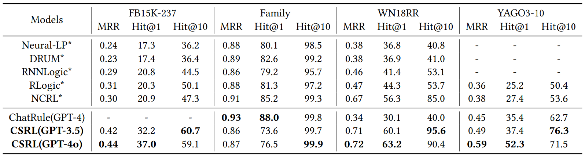
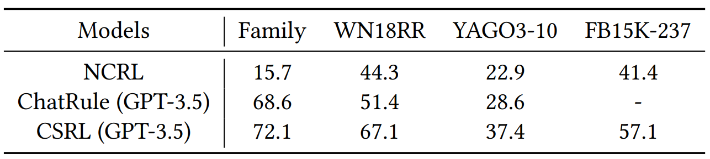
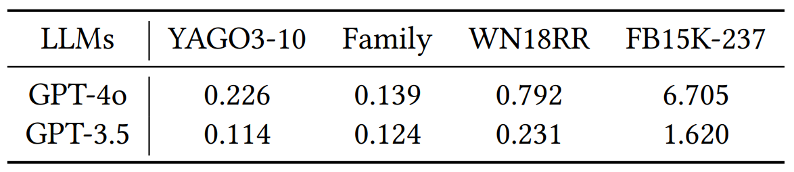
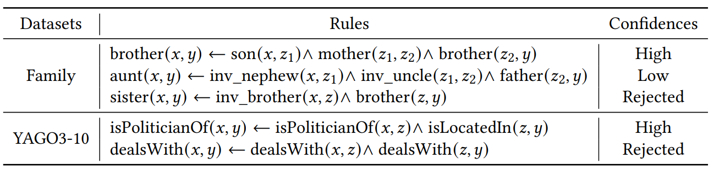

<div align="center">    
 
# A Unified Framework for Rule Learning: Integrating Commonsense Knowledge from LLMs with Structured Knowledge from Knowledge Graphs

</div>

- [Overview](#overview)
- [Requirements](#requirements)
- [Dataset](#dataset)
- [Usage](#usage)
- [Results](#results)
- [Acknowledgement](#acknowledgement)
 
## Overview  

Learning logical rules that align to real world and truly have  **causal** relationships, while mitigating **hallucinations**.

This is the official implementation of the paper ["A Unified Framework for Rule Learning: Integrating Commonsense Knowledge from LLMs with Structured Knowledge from Knowledge Graphs"](https://openreview.net/pdf?id=8m3MYjLk0y).



<br/>
Traditional rule learning methods primarily rely on structured knowledge from Knowledge Graphs (KGs). As a result, they struggle to identify causal relationships and can only capture frequent co-occurrence patterns within the graph. In other words, they lack commonsense reasoning capabilities and fail to align with the real world.

On the other hand, Large Language Models (LLMs) offer rich commonsense knowledge but are prone to hallucinations, which undermines their reliability in logical rule learning. The structured knowledge in KGs can serve as an external reference to mitigate these hallucinations.

To harness the strengths of both approaches, we propose a unified framework called CSRL. This framework integrates the commonsense knowledge of LLMs with the structured knowledge from KGs for logical rule learning. CSRL achieves a seamless and efficient integration of these two types of knowledge, ultimately producing a result where the whole is greater than the sum of its parts.

## Requirements
1. Clone the repository:
 ```bash
 git clone https://github.com/PerseidsMeteorShower/CSRL.git
 ```

2. Install the required libraries:
```bash
pip install -r requirements.txt
```
3. Replace the API key with your own OpenAI key in the config.json
```bash
{
    "openai_api_key": "sk-xx"
}
```

## Dataset

We provide four datasets for knowledge graph reasoning: [FB15K-237](https://www.cs.princeton.edu/~danqic/papers/cvsc2015.pdf), [Family](https://www.cs.toronto.edu/~hinton/absps/families.pdf), [WN18RR](https://arxiv.org/pdf/1707.01476), [YAGO3-10](https://dl.acm.org/doi/10.1145/1242572.1242667).



Details of the files in the dataset.

* entities.txt: a collection of entities in the KG
* relations.txt: a collection of relations in the KG
* facts.txt: a collection of facts in the KG 
* train.txt: the model is trained to fit the triples in this data set
* valid.txt: create a blank file if no validation data is available
* test.txt: the learned ryles is evaluated on this data set for KG completion task

## Usage

The following is an example based on the CSRL learning logical rules and verifies the reliability of the rules.

1. Apply CSRL to learn reliable rules.
```
  python main.py --data_type family --max_path_len 3 --anchor_num 1000 --gpt_model gpt-3.5-turbo  --temperature 1
```
Meanings of each parameter:

* --data_type: The name of the dataset (lowercase format).
* --max_path_len: The maximum length of the generated rules.
* --anchor_num: The number of anchors to be sampled.
* --gpt_model: The GPT model uesd for conducting commonsense reasoning.
* --temperature: The temperature setting for dynamic sampling, which adjust the probability to sample according to candidate rules against random sampling.

2. Adopting KG completion task to verify the reasoning reliability of these rules.
```
  python kg_completion.py --data_type family -p results
```
Meanings of each parameter:

* --data_type: The name of the dataset (lowercase format).
* -p: The path of the learned rules.

3. Adopting LLM-based semantic assessment task to verify the semantic reliability of these rules.
```
  python semantic_assessment.py --data_type family -p results --max_path_len 3 --gpt_model gpt-4o --eva_num 70
```

* --data_type: The name of the dataset (lowercase format).
* -p: The path of the learned rules.
* --max_path_len: The maximum length of the learned rules.
* --gpt_model: The GPT model uesd to assess the semantic reliability of rules, which should be as advanced as possible.
* --eva_num: Number of rules to be tested.

## Results
1. KG Completion.



2. LLM-based Semantic Assessment. 



3. Human-based Semantic Assessment


4. LLM Cost



5. Case Studies



## Acknowledgement

Our test code of the KG completion task is primarily derived from [ChatRule](https://arxiv.org/abs/2309.01538), while we make adjustments to the rule ranking method and employed a balanced evaluation approach.

We express our gratitude to the authors for their excellent contributions.
